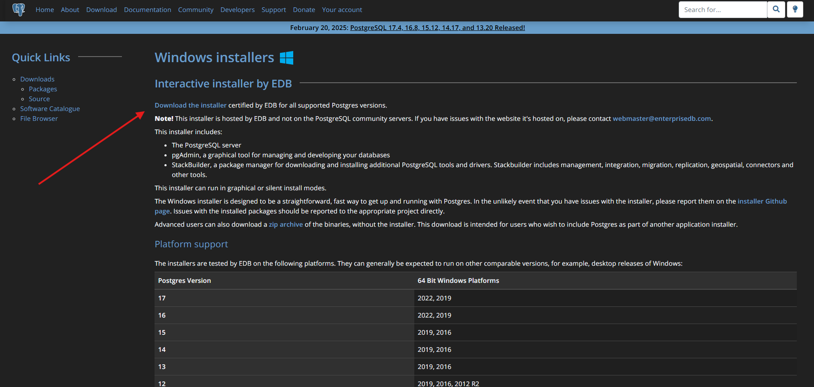

---

# Overview
Documenting and learning PostgreSQL.

---

# Download and install
Process in downloading and installing PostgreSQL.\
These steps will also include downloading pgAdmin, a PostgreSQL tool.

### Download PostgreSQL
Navigate to the [PostgreSQL Website](https://www.postgresql.org/).

Click the "Download" button.\
On the download page, select the installer for your operating system.

> In my case, I'll be downloading the windows installer.

This page will have a list of Postgres versions currently available for the chosen platform.\
There should be a "Download the installer" link on the page which will reroute to the download page.

{class="custom-image-size-class"}

Download the preferred program version, typically the latest version.

### Install components
Execute the downloaded application.\
The app will open to a setup wizard.

Setup wizard steps:
- Click the "Next" button to get started
- Specify the directory for the PostgreSQL install
- Select the components to install ( make sure pgAdmin is chosen )
- Specify a directory to store PostgreSQL data
- Provide a password for the database superuser
- Select a port number
- Select the locale for the database cluster to use
- Confirm the settings for the installation
- Click the "Next button to confirm install

The setup wizard should now be installing the chosen components.\
I kept all of the defaults for my install

Once the install is completed, click "Finish" and the application will close.

---

# Summary
- Downloaded PostgreSQL
- Installed PostgreSQL
- Downloaded pgAdmin

---

# References
A comprehensive list of page references

### PostgreSQL
- [PostgreSQL Website](https://www.postgresql.org/)
- [PostgreSQL Docs](https://www.postgresql.org/docs/)
