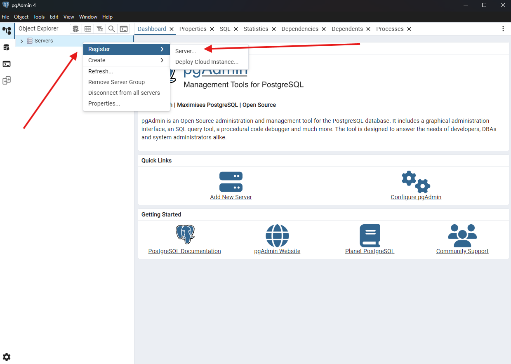
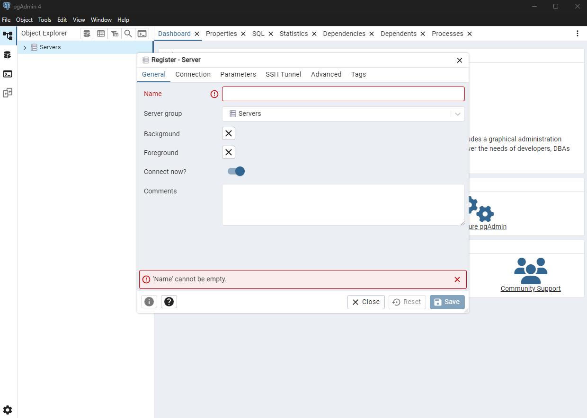
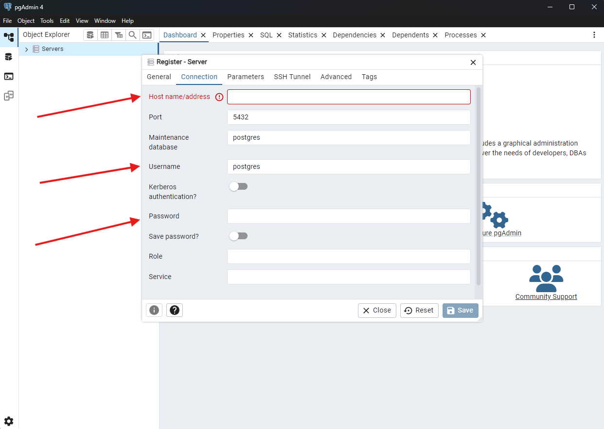
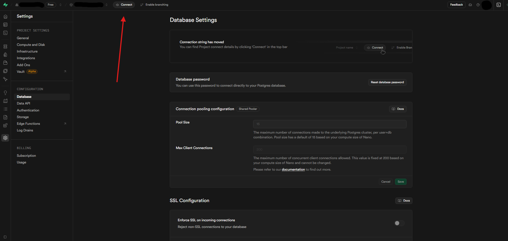
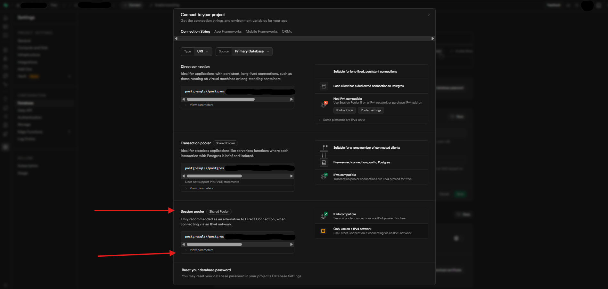
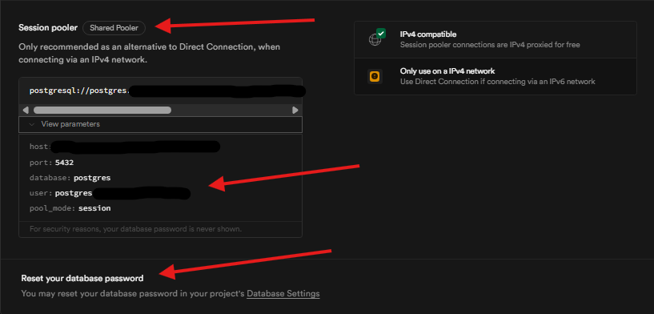
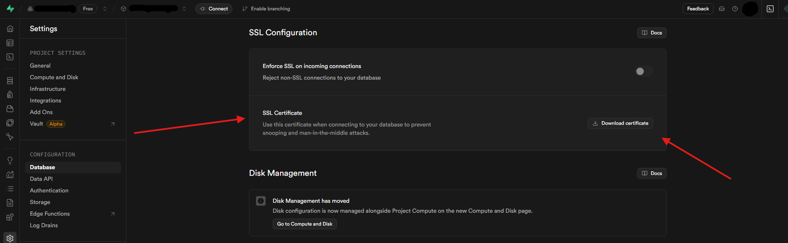
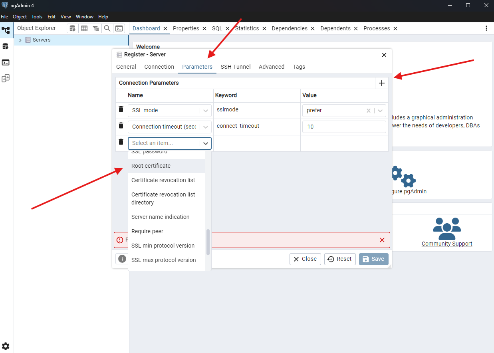

---

# Overview
Documenting the process in connecting a local pgAdmin server with the Supabase database.. I'll be using both the [Supabase - Connecting with pgAdmin](https://supabase.com/docs/guides/database/pgadmin) guide and [pgAdmin Tutorial - How to Use pgAdmin | Database Star](https://youtu.be/WFT5MaZN6g4?si=pogijNMuaDmjA-cS) video as references for this document.

---

# Prerequisites
This database project will use:
- PostgreSQL
- pgAdmin
- Supabase

### Setup docs
Follow each doc for individual setup:
- [PostgreSQL | Setup]()
- [pgAdmin | Introduction]()
- [Supabase | Setup]()

### Completed 
- PostgreSQL is installed
- pgAdmin is installed
- A Supabase account & project have been setup

---

# Database setup
Using pgAdmin, register a local server and connect it to the Supabase database.

### Register a server
Open the pgAdmin application.

On the left bar:
- Right click "Servers"
- Hover over "Register"
- Click "Server..."

{class="custom-image-size-class"}

A popup window should appear with necessary fields for server creation.

{class="custom-image-size-class"}

#### General tab
Under the General tab:
- Create a name for the server ( Mandatory )
- Chose a server group, or leave it as default
- Chose a background color
- Chose a foreground color
- Toggle if the server should connect immediately
- Leave any additional comments

Once completed, keep pgAdmin and the "Register - Server" popup open, then move on to the next section.

# Connecting to Supabase
In order to connect with Supabase we'll need to fill out some fields. The values for these fields will be located in the Supabase project.

### Connection tab
Click the Connection tab.

The following fields need to be populated:
- Host name/address
- Username
- Password

{class="custom-image-size-class"}

In order to populate these fields we'll have to pull them from Supabase.

### Supabase database connections
Navigate to your [Supabase Database Settings](https://supabase.com/dashboard/project/_/settings/database) page.

Click the "Connect" button on the top nav bar.

{class="custom-image-size-class"}

This will open the project connect menu. Once open, click "View parameters" under the Session pooler section. From here, we can copy the connection parameters necessary for the new server being set up in pgAdmin.

{class="custom-image-size-class"}

{class="custom-image-size-class"}

Copy / paste the following:
- Supabase host value => pgAdmin Host name/address field.
- Supabase user value => pgAdmin Username field.
- Supabase password value => pgAdmin Password field.

The Supabase password value will not be shown. This value will be the same password that was setup with the project. If the password is lost or forgotten, the Supabase database password can be reset in the [Supabase Database Settings](https://supabase.com/dashboard/project/_/settings/database).

Once completed, keep pgAdmin and the "Register - Server" popup open, then move on to the next subsection.

### Supabase SSL certificate
Navigate to your [Supabase Database Settings](https://supabase.com/dashboard/project/_/settings/database) page.

Scroll down on the page and locate the "SSL Configuration" section. There should be an "SSL Certificate" item with a button that says "Download Certificate" to the right. Click that button to start the download. Move the certificate file location to somewhere secure that can be remembered.

{class="custom-image-size-class"}

We'll be using this certificate for the next subsection.

### Parameters tab
In the pgAdmin "Register - Server" popup, click the Parameters tab.

A new connection parameter will need to be created in order to connect with Supabase.

{class="custom-image-size-class"}

To create a new connection parameter:
- Click the "Plus" button to the top right to add a new field
- Select the "Root certificate" item
- The keyword should automatically populate
- For the value field, select the SSL certificate file that was just downloaded.

Once completed, keep pgAdmin and the "Register - Server" popup open, then move on to the next subsection.

### Save the new server
Once all of the above steps have been completed, click the save button to the bottom right. If done correctly, there should be a new server, with it's own database, listed under the chosen server group to the left. This server should now be connected to the Supabase PostgreSQL database.

---

# Summary
In this document we:
- Registered a new server in pgAdmin
- Connected the new server to Supabase
- Used SSL to connect with the server

---

# References
A comprehensive list of page references

### Supabase
- [Supabase - Connecting with pgAdmin](https://supabase.com/docs/guides/database/pgadmin)
- [Supabase Website](https://supabase.com/)
- [Supabase Docs](https://supabase.com/docs)
- [Supabase Database Docs](https://supabase.com/docs/guides/database/overview)
- [Supabase Database Settings](https://supabase.com/dashboard/project/_/settings/database)

### Videos
- [pgAdmin Tutorial - How to Use pgAdmin | Database Star](https://youtu.be/WFT5MaZN6g4?si=pogijNMuaDmjA-cS)

### Site Docs
- [PostgreSQL | Setup]()
- [pgAdmin | Introduction]()
- [Supabase | Setup]()
