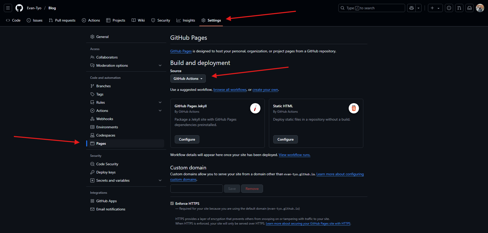
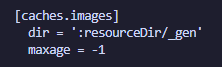
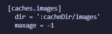

---

# Overview
Documenting my process in deploying my Hugo site.\
GitHub Pages will be used for this deployment process.

I will be following Hugo's [Host on GitHub Pages](https://gohugo.io/host-and-deploy/host-on-github-pages/) Guide.\
For my examples I'll be using hugo.yaml.

---

# Prerequisites
In order to deploy to GitHub pages a few things will need to be completed.

- [Setup a Hugo site]()
- [Create a GitHub Account](https://github.com/)
- [Create a GitHub Repository](https://github.com/new)
- Push the local hugo project to the GitHub repository

I will not be providing steps on how to setup GitHub or a new repository.\
For information on how to setup a new repository, check out [GitHub's Quickstart Guide](https://docs.github.com/en/repositories/creating-and-managing-repositories/quickstart-for-repositories)

---

# Update the GitHub repo
The repository will need a minor update before next steps.\
Follow the steps below:

- Navigate to the GitHub repository
- In the top menu, go to Settings
- On the left menu, go to Pages
- Under Build and deployment, click the Source dropdown
- Change the source to "GitHub Actions"

This will automatically update the repository.


{class="build-and-deployment-image-class"}

---

# Update the Hugo caches setting
The caches images directory setting will need an update.\
In the local repository navigate to your hugo site configuration file.

### Default caches setting value 
The default setting value is shown below:

```
caches:
    images:
        dir: :resourceDir/_gen
```

This setting may not be part of your hugo site configuration file, but it will still show as default.\
To check what the current setting value is, run the following command:

```
hugo config
```

The command will display every setting in your hugo config.\
Find the caches section to see what that default value is:


{class="caches-settings-image-class"}

### Update caches setting value
To update the setting value, add the following to the config:

```
caches:
    images:
        dir: :cacheDir/images
```

Save the config, and run the ``` hugo config ``` command again to check the new setting value:


{class="caches-settings-image-class"}

More information on the caches settings can be found at the [Configure file caches](https://gohugo.io/configuration/caches/) page.

<!-- 
    [caches.images]
    dir = ":resourceDir/_gen"
 -->

---

# Setup the Hugo workflow
To deploy the site to GitHub pages, a Hugo config file will be added to a workflow directory.

### GitHub Workflows
Workflows are yaml config files used to trigger jobs for a project repository.\
Jobs define a series of steps to be executed, and can utilize actions to reduce repeatable code.

More information on GitHub Workflows and GitHub Actions can be found below:
- [GitHub Workflows](https://docs.github.com/en/actions/writing-workflows/about-workflows)
- [GitHub Actions](https://docs.github.com/en/actions/about-github-actions/understanding-github-actions)

### Create the workflow
At the root of the project create a ``` .github/workflows ``` directory with the following command:

```
mkdir -p .github/workflows
```

Now, create a ``` hugo.yaml ``` file within that directory with the following command:

```
touch .github/workflows/hugo.yaml
```

### Populate the workflow
Paste the below YAML into the newly created file.

```
# Sample workflow for building and deploying a Hugo site to GitHub Pages
name: Deploy Hugo site to Pages

on:
  # Runs on pushes targeting the default branch
  push:
    branches:
      - main

  # Allows you to run this workflow manually from the Actions tab
  workflow_dispatch:

# Sets permissions of the GITHUB_TOKEN to allow deployment to GitHub Pages
permissions:
  contents: read
  pages: write
  id-token: write

# Allow only one concurrent deployment, skipping runs queued between the run in-progress and latest queued.
# However, do NOT cancel in-progress runs as we want to allow these production deployments to complete.
concurrency:
  group: "pages"
  cancel-in-progress: false

# Default to bash
defaults:
  run:
    shell: bash

jobs:
  # Build job
  build:
    runs-on: ubuntu-latest
    env:
      HUGO_VERSION: 0.145.0
      HUGO_ENVIRONMENT: production
      TZ: America/Los_Angeles
    steps:
      - name: Install Hugo CLI
        run: |
          wget -O ${{ runner.temp }}/hugo.deb https://github.com/gohugoio/hugo/releases/download/v${HUGO_VERSION}/hugo_extended_${HUGO_VERSION}_linux-amd64.deb \
          && sudo dpkg -i ${{ runner.temp }}/hugo.deb
      - name: Install Dart Sass
        run: sudo snap install dart-sass
      - name: Checkout
        uses: actions/checkout@v4
        with:
          submodules: recursive
          fetch-depth: 0
      - name: Setup Pages
        id: pages
        uses: actions/configure-pages@v5
      - name: Install Node.js dependencies
        run: "[[ -f package-lock.json || -f npm-shrinkwrap.json ]] && npm ci || true"
      - name: Cache Restore
        id: cache-restore
        uses: actions/cache/restore@v4
        with:
          path: |
            ${{ runner.temp }}/hugo_cache
          key: hugo-${{ github.run_id }}
          restore-keys:
            hugo-
      - name: Configure Git
        run: git config core.quotepath false
      - name: Build with Hugo
        run: |
          hugo \
            --gc \
            --minify \
            --baseURL "${{ steps.pages.outputs.base_url }}/" \
            --cacheDir "${{ runner.temp }}/hugo_cache"
      - name: Cache Save
        id: cache-save
        uses: actions/cache/save@v4
        with:
          path: |
            ${{ runner.temp }}/hugo_cache
          key: ${{ steps.cache-restore.outputs.cache-primary-key }}
      - name: Upload artifact
        uses: actions/upload-pages-artifact@v3
        with:
          path: ./public

  # Deployment job
  deploy:
    environment:
      name: github-pages
      url: ${{ steps.deployment.outputs.page_url }}
    runs-on: ubuntu-latest
    needs: build
    steps:
      - name: Deploy to GitHub Pages
        id: deployment
        uses: actions/deploy-pages@v4
```

### Check the Hugo version
I recommend using the same version of Hugo both locally and in the workflow.\
This can be beneficial in keeping behavior consistent across different environments.

To check the local version of Hugo, run the following:

```
hugo version
```

Consider updating your local version, or the workflow version, to match the two.

---

### Push the changes
Create a commit and push these changes to your GitHub repository.\
The following commands can be ran:

```
git add .
git commit -m "Create hugo.yaml"
git push
```

Running these commands will
- Stage every file changes
- Commit those staged changes using the commit message
- Push the committed changes to the remote repository

---

# Access the deployed site
When the workflow event triggers, the workflow jobs will start running.\
If your branch is set to the main branch then the jobs will only trigger when pushed to main.

> I have been branching off the main branch for all of my changes, so my workflow will not trigger until I merge my branch into the main branch.

Once the workflow jobs have completed, the static site will be live.

### Locate the static site link
The link will be attached to the workflow build action.\
In order to locate it, follow these steps:

- Navigate to the GitHub repository
- In the top menu, go to Actions
- There should be a workflow in progress colored orange
- Once the workflow is complete it will be colored green
- Click into that workflow
- Click the static site link listed until "deploy"

( placeholder pictures )

Now you should have access to the live site.\
Whenever new changes are pushed to the specified branch:

- The workflow will trigger
- The build will start
- The changes will then be deployed
- The site will be updated

---

# Summary
In this document we:
- Updated the GitHub repo pages source
- Updated the Hugo config caches setting value
- Briefly explained GitHub workflows
- Created the Hugo workflow file for GitHub
- Pushed the new file and changes
- Navigated to the Hugo static site

Thank you for following along and I hope this document was helpful.

---

# References
A comprehensive list of page references

### GitHub
- [GitHub Pages](https://pages.github.com/)
- [Create a GitHub Account](https://github.com/)
- [Create a GitHub Repository](https://github.com/new)
- [GitHub's Quickstart Guide](https://docs.github.com/en/repositories/creating-and-managing-repositories/quickstart-for-repositories)
- [GitHub Workflows](https://docs.github.com/en/actions/writing-workflows/about-workflows)
- [GitHub Actions](https://docs.github.com/en/actions/about-github-actions/understanding-github-actions)

### Hugo
- [Host on GitHub Pages](https://gohugo.io/host-and-deploy/host-on-github-pages/)
- [Configure file caches](https://gohugo.io/configuration/caches/)