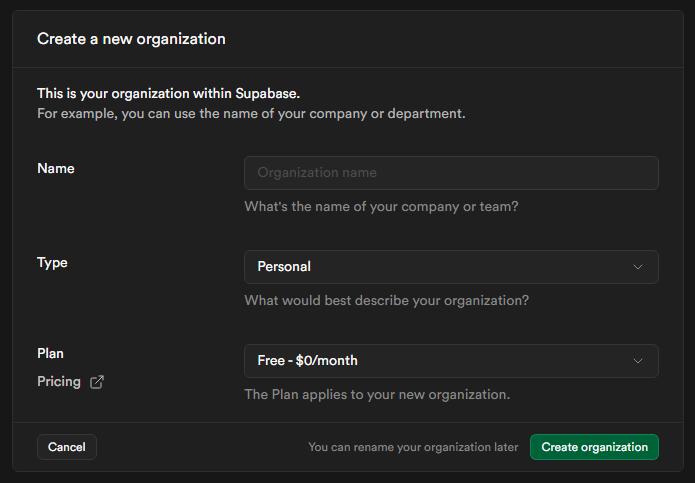
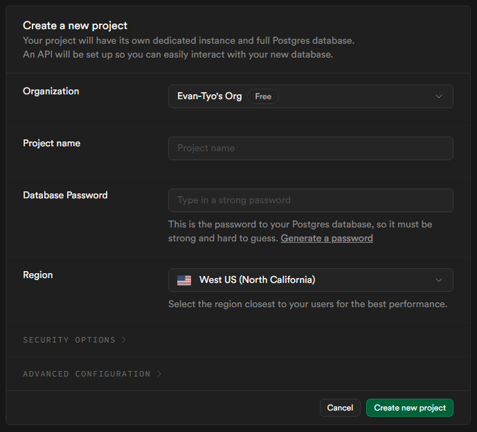
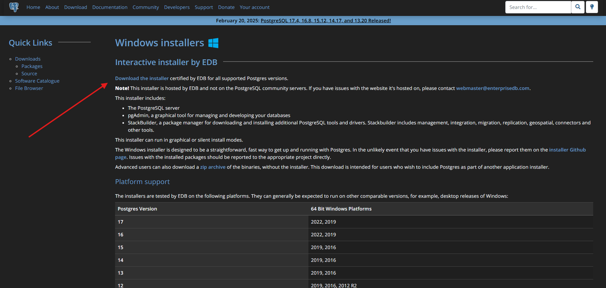

---

# Overview
Documenting the process and details on setting up the database for the Overwatch Stadium API project.

---

# Research ( Placeholder )
`Information about this section`

### Subsection 1
`Content`

### Subsection 2
`Content`

---

# Supabase - Account Creation
Process in setting up a Supabase account for PostgreSQL use.

### Process
Navigate to the [Supabase Website](https://supabase.com/).

> I would recommend reading up on the [Supabase Docs](https://supabase.com/docs) to familiarize with the service. Considering I'll be hosting a PostgreSQL database on Supabase, I took a look through the [Supabase Database Docs](https://supabase.com/docs/guides/database/overview).

Click the "Start your project" button.\
This will bring you to a page to Sign Up for an account.

I opted to "Continue with GitHub" and authorized my GitHub account to create my Supabase account.\
Once an account is created, the page will redirect to a "Create a new organization" form.

The form asks for:
- Name: An organization name.
- Type: The chosen organization type.
- Plan: A plan applied to this new organization.

{class="custom-image-size-class"}

> I chose the free plan because I ain't looking to spend until I gotta.

After filling out the form, click "Create Organization".\
This will redirect to a page with a "Create a new project" form.

The form asks for:
- Organization: This should auto populate to the organization just created.
- Project name: A project name.
- Database Password: Setting a password for the project.
- Region: Select the region closest to the primary users.

Additional, Security Options and Advanced Configuration can be adjusted.\
I decided to keep the defaults for my project.

{class="custom-image-size-class"}

Click "Create new project" to finalize the form.

---

# PostgreSQL
Process in downloading and installing PostgreSQL.\
These steps will also include downloading pgAdmin, a PostgreSQL tool.

### About pgAdmin

### Download applications
Navigate to the [PostgreSQL Website](https://www.postgresql.org/).

Click the "Download" button.\
On the download page, select the installer for your operating system.

> In my case, I'll be downloading the windows installer.

This page will have a list of Postgres versions currently available for the chosen platform.\
There should be a "Download the installer" link on the page which will reroute to the download page.

{class="custom-image-size-class"}

Download the preferred program version, typically the latest version.

### Install components
Execute the downloaded application.\
The app will open to a setup wizard.

Setup wizard steps:
- Click the "Next" button to get started
- Specify the directory for the PostgreSQL install
- Select the components to install ( make sure pgAdmin is chosen )
- Specify a directory to store PostgreSQL data
- Provide a password for the database superuser
- Select a port number
- Select the locale for the database cluster to use
- Confirm the settings for the installation
- Click the "Next button to confirm install

The setup wizard should now be installing the chosen components.

> For my install I kept all of the defaults

Once the install is completed, click "Finish" and the application will close.\

### Startup pgAdmin
Open the pgAdmin 4 application.

---

# Summary
`Summary list of this page`

---

# References
`A comprehensive list of page references`

### Supabase
- [Supabase Website](https://supabase.com/)
- [Supabase Docs](https://supabase.com/docs)
- [Supabase Database Docs](https://supabase.com/docs/guides/database/overview)

### PostgreSQL
- [PostgreSQL Website](https://www.postgresql.org/)
- [PostgreSQL Docs](https://www.postgresql.org/docs/)
